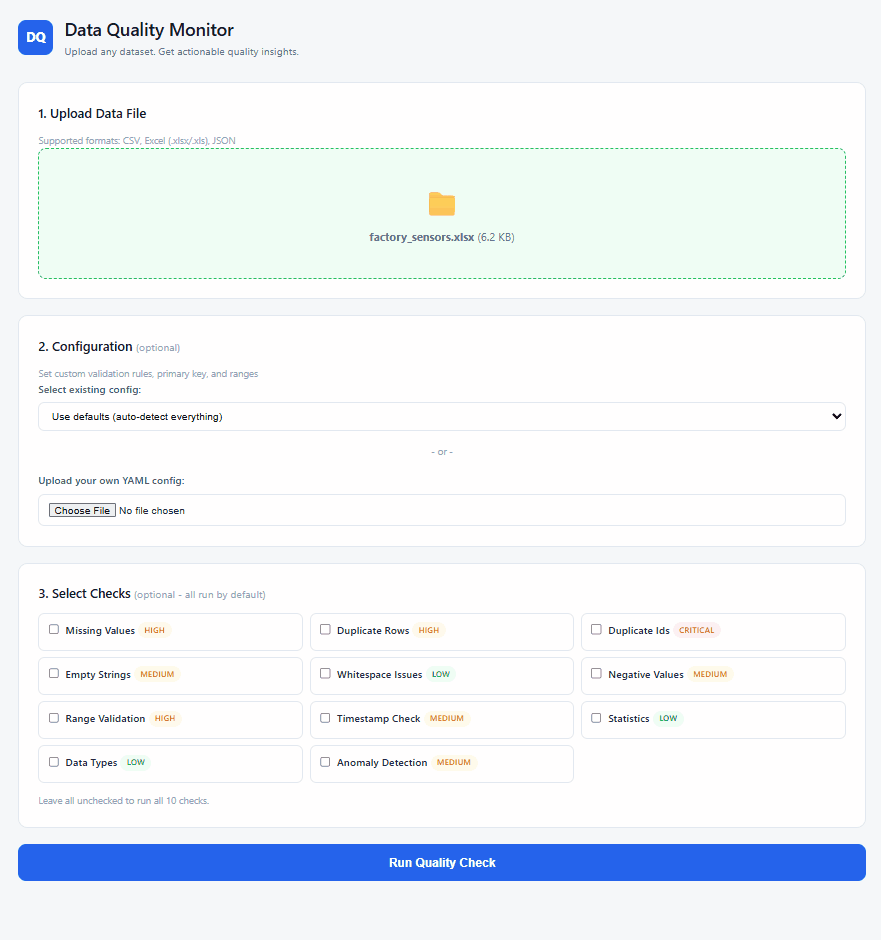

# Data Quality Monitoring Framework

A scalable, class-based Python framework that automates data quality checks on any tabular dataset, identifies exactly which records have problems, provides actionable recommendations, logs everything to a database for trend tracking, and feeds into Power BI dashboards for data governance visibility.

## Demo



## The Problem This Solves

Bad data gets into production systems and nobody catches it until something breaks - a report goes out with wrong numbers, a dashboard shows impossible values, an ML model trains on corrupted data. Manual quality checks don't scale when you have dozens of data sources refreshing daily.

This framework shifts data quality from reactive ("we found a bug in last month's report") to proactive ("data quality is trending down, let's investigate before it affects anything"). It runs automated checks on any dataset, scores the quality, tells you exactly which rows have problems and what to do about them, and tracks trends over time.

## Migration Story

This started as a single flat Python script (`check_quality.py`) with standalone functions, a global `lines` list for output, and hardcoded validation rules. It worked for small files but had no scalability - adding a new check meant modifying the main flow, there was no way to configure rules per data source, no historical tracking, and no way to tell which specific rows had problems.

The class-based refactor was driven by real interview feedback: "it should be scalable and use classes." The result is an architecture where the engine never changes regardless of what's added - new checks, new storage backends, ML pipeline, API layer, containerization all plug in through the existing interfaces.

## Architecture

```
data_quality/
├── main.py                 # CLI entry point
├── app.py                  # Flask web UI
├── engine.py               # Orchestrator (pipeline coordination)
├── loader.py               # File loading (CSV, Excel, JSON)
├── config_manager.py       # YAML config loader (per-data-source rules)
├── scorer.py               # KPI computation (weighted score + grade)
├── result_store.py         # SQLite persistence (4 tables)
├── report_generator.py     # Formatted reports with recommendations
├── __init__.py
├── checks/
│   ├── __init__.py
│   ├── base_check.py       # ABC + CheckResult + FlaggedRecord + ColumnProfile
│   ├── all_checks.py       # 10 concrete check implementations
│   └── registry.py         # Auto-discovery + registration of checks
├── templates/
│   ├── upload.html         # Upload page (drag-drop, config, check selection)
│   └── results.html        # Results dashboard (gauge, cards, flagged table)
├── static/
│   └── style.css           # Clean minimal blue/white stylesheet
├── configs/
│   ├── hr_system.yaml
│   ├── factory_iot.yaml
│   ├── erp_export.yaml
│   └── customer_data.yaml
├── data_gen/
│   ├── generate_history.py # Historical data generator (configurable dates)
│   ├── export_for_powerbi.py  # CSV export for Power BI
│   └── powerbi_scripts.py  # Python scripts to paste into Power BI
├── samples/                # Sample data files for testing
│   ├── hr_system.csv
│   ├── factory_sensors.xlsx
│   ├── erp_export.json
│   └── customer_data.xlsx
├── db/
│   └── quality_results.db  # SQLite database (auto-created)
├── uploads/                # Temporary uploaded files (auto-created)
├── reports/                # Saved text reports (auto-created)
└── flagged_records/        # Exported flagged record CSVs (auto-created)
```

## Design Patterns

- **Strategy Pattern**: Each check is a pluggable strategy - inherits `BaseCheck`, implements `execute()`, returns a standardized `CheckResult`. Adding a new check never requires modifying the engine.
- **Registry Pattern**: `CheckRegistry` auto-discovers all built-in checks on initialization. Custom checks register with one line at runtime.
- **Template Method**: `BaseCheck._make_result()` standardizes result construction across all checks.
- **Open/Closed Principle**: The framework is open for extension (new checks, new storage backends, new consumers) and closed for modification - the engine never changes.
- **Config-Driven**: YAML configs per data source define custom ranges, enable/disable checks, and set thresholds without touching Python code.

## Setup

```bash
# install dependencies
pip install pandas pyyaml openpyxl numpy flask

# recommended: prevent Python bytecode caching issues during development
# Linux/Mac:
export PYTHONDONTWRITEBYTECODE=1
# Windows:
set PYTHONDONTWRITEBYTECODE=1
```

## Quick Start

```bash
# run on any file (all checks, parallel execution)
python main.py samples/hr_system.csv
python main.py samples/factory_sensors.xlsx
python main.py samples/erp_export.json
python main.py samples/customer_data.xlsx

# run with data-source-specific config
python main.py samples/hr_system.csv -c configs/customer_data.yaml

# verbose mode: see exactly which rows have problems
python main.py samples/hr_system.csv -v

# export flagged records as CSV (saved to flagged_records/ folder)
python main.py samples/hr_system.csv --export-csv

# save text report to reports/ folder
python main.py samples/hr_system.csv --save-report

# combine flags
python main.py samples/hr_system.csv -v --export-csv --save-report

# sequential execution (for debugging)
python main.py samples/hr_system.csv --no-parallel

# view run history
python main.py --history
python main.py --history -f hr_system.csv

# generate historical data for Power BI (runs from data_gen/ subfolder)
python data_gen/generate_history.py --clean --start 2025-11-01 --end 2026-04-21 --runs 40

# then run your own file - both use the same database
python main.py your_data.csv -v --export-csv
```

## Web UI (Flask)

A browser-based interface wrapping the same engine. Upload a file, see results as a visual dashboard.

```bash
# install Flask
pip install flask

# start the web server
python app.py

# open in browser
# http://127.0.0.1:5000
```

**Upload Page** - Drag-and-drop file upload, config selection (upload your own YAML / select from dropdown / use defaults), and checkboxes to select which checks to run.

**Results Dashboard** - KPI cards (score, grade, rows, issues, flagged count), score gauge, quality dimension bars, an ML-powered **score forecast chart** (historical scores plotted solid, predicted next 3 runs plotted as a dashed continuation, with a trend badge - improving/stable/declining), data preview table, expandable check results with severity badges (the ML-backed `anomaly_detection` check carries a distinct **ML badge** so it reads apart from the 10 rule-based checks at a glance), searchable/filterable flagged records table, recommendations summary, download buttons for CSV and text report, and run history.

The web UI calls the same `engine.run()` as the CLI - no separate logic, no code duplication. Results go to the same SQLite database, and the forecast chart reads from the same `models/*.joblib` bundles the CLI's `--forecast` flag uses.

## What the Report Shows

The report is designed to be actionable, not just informational:

- **Data Preview**: First 5 rows so you see what you're working with
- **Primary Key Detection**: Auto-detects the primary key column (first unique ID column) for row-level references, overridable via config
- **Automatic Datetime Detection**: Converts string columns to datetime before any checks run, so profiling and timestamp checks see correct types
- **Severity-Ordered Results**: Critical issues first, passes last - you see what matters immediately
- **Row-Level Flagging**: Tells you exactly which records have problems, referenced by primary key with surrounding context
- **Deviation Scores**: How far off-range values are from normal (in standard deviations) - feeds ML later
- **Actionable Recommendations**: Each failing check suggests what to do (fix, review, delete, investigate)
- **Recommendations Summary**: Priority-ordered list at the bottom of the report
- **CSV Export**: Export all flagged records as a spreadsheet to share with your team - each run creates a timestamped file in `flagged_records/`

Example verbose output:

```
[FAIL] RANGE_VALIDATION (validity | high)
Issues: 4 / 45 (8.89%)
Action: fix
  age: 1 values below min (0)
  age: 1 values above max (120)
  >> Values outside expected ranges. Verify against business rules or adjust range config.
  Flagged records (showing up to 5 of 4):
    → Row 14 (employee_id: E015) | age = -3.0 | expected: >= 0 (deviation: 1.24σ)
    → Row 7  (employee_id: E008) | age = 155.0 | expected: <= 120 (deviation: 3.29σ)
```

## Checks Included

| Check             | Category     | Severity | Action Type | Description                           |
| ----------------- | ------------ | -------- | ----------- | ------------------------------------- |
| missing_values    | completeness | high     | fix         | Null/missing values per column        |
| duplicate_rows    | uniqueness   | high     | delete      | Fully duplicated rows                 |
| duplicate_ids     | uniqueness   | critical | investigate | Duplicate values in ID columns        |
| empty_strings     | completeness | medium   | fix         | Empty strings in text columns         |
| whitespace_issues | consistency  | low      | fix         | Leading/trailing spaces               |
| negative_values   | validity     | medium   | review      | Negative numbers in numeric columns   |
| range_validation  | validity     | high     | fix         | Values outside expected ranges        |
| timestamp_check   | consistency  | medium   | investigate | Date ordering, future dates, gaps     |
| statistics        | profiling    | low      | -           | Min, max, mean, std per column        |
| data_types        | profiling    | low      | -           | Column dtype reporting                |
| anomaly_detection | ml_anomaly   | medium   | review      | Column stats vs historical norms (ML) |

All 8 actionable checks (everything except statistics and data_types) produce row-level flagged records with primary key references, context columns, and deviation scores.

## Adding a Custom Check

```python
from checks import BaseCheck, CheckResult, FlaggedRecord

class EmailFormatCheck(BaseCheck):
    name = "email_format"
    description = "Validates email format"
    category = "validity"
    severity = "medium"

    def execute(self, df, pk_col=None, context_cols=None):
        flagged = []
        # ... your validation logic, build FlaggedRecord objects ...
        return self._make_result(
            passed=(len(flagged) == 0),
            issue_count=len(flagged),
            total_checked=len(df),
            details=["..."],
            flagged_records=flagged,
            recommendation="Fix invalid email formats.",
            action_type="fix",
        )

# Register it - engine picks it up automatically
engine = QualityEngine()
engine.register_custom_check(EmailFormatCheck)
```

## Config-Driven Rules

Create a YAML file in `configs/` for each data source - no code changes needed:

```yaml
data_source: "sales_data"
primary_key: "order_id"
context_columns: ["order_id", "customer", "amount", "date"]

checks:
  enabled: [] # empty = run all
  disabled:
    - statistics

ranges:
  price: [0, 10000]
  quantity: [0, 500]
  age: [18, 100]

thresholds:
  max_missing_pct: 2.0
  max_duplicate_pct: 1.0
```

## Database Schema (SQLite)

All data is stored in `db/quality_results.db` with 4 tables. The schema is designed for Power BI consumption as a star schema - `runs` is the central fact table, the other three provide detail.

### runs (fact table - one row per execution)

| Column        | Type       | Description                                      |
| ------------- | ---------- | ------------------------------------------------ |
| run_id        | INTEGER PK | Auto-incrementing run identifier                 |
| file_name     | TEXT       | Source file name                                 |
| data_source   | TEXT       | Data source identifier from config               |
| run_timestamp | TEXT       | ISO format datetime of the run                   |
| row_count     | INTEGER    | Number of rows in the dataset                    |
| column_count  | INTEGER    | Number of columns                                |
| overall_score | REAL       | Weighted quality score (0-100)                   |
| grade         | TEXT       | Letter grade: A (Excellent) through F (Critical) |
| total_issues  | INTEGER    | Count of failing checks                          |

### check_results (one row per check per run)

| Column         | Type       | Description                                                |
| -------------- | ---------- | ---------------------------------------------------------- |
| result_id      | INTEGER PK | Auto-incrementing                                          |
| run_id         | INTEGER FK | Links to runs.run_id                                       |
| check_name     | TEXT       | Name of the check (e.g. missing_values)                    |
| category       | TEXT       | completeness, uniqueness, validity, consistency, profiling |
| severity       | TEXT       | critical, high, medium, low                                |
| passed         | INTEGER    | 1 = passed, 0 = failed                                     |
| issue_count    | INTEGER    | Number of issues found                                     |
| total_checked  | INTEGER    | Number of items checked                                    |
| issue_pct      | REAL       | Percentage of items with issues                            |
| details        | TEXT       | JSON array of detail strings                               |
| recommendation | TEXT       | Actionable recommendation text                             |
| action_type    | TEXT       | fix, review, delete, investigate                           |

### flagged_records (row-level detail - for drill-through and ML)

| Column      | Type       | Description                                                    |
| ----------- | ---------- | -------------------------------------------------------------- |
| flag_id     | INTEGER PK | Auto-incrementing                                              |
| run_id      | INTEGER FK | Links to runs.run_id                                           |
| check_name  | TEXT       | Which check flagged this record                                |
| row_index   | INTEGER    | Row number in the original dataset                             |
| primary_key | TEXT       | JSON dict of PK column and value                               |
| column_name | TEXT       | Which column has the issue                                     |
| value       | TEXT       | The actual problematic value                                   |
| rule        | TEXT       | What rule was violated (e.g. below_min, missing, duplicate_id) |
| expected    | TEXT       | What the value should have been (e.g. ">= 0", "not null")      |
| severity    | TEXT       | critical, high, medium, low                                    |
| action_type | TEXT       | fix, review, delete, investigate                               |
| context     | TEXT       | JSON dict of surrounding column values for reference           |
| deviation   | REAL       | Standard deviations from mean (for ML features)                |

Capped at 100 flagged records per check per run to prevent database bloat on large datasets.

### column_profiles (structured stats per column - for ML training)

| Column       | Type       | Description                                                  |
| ------------ | ---------- | ------------------------------------------------------------ |
| profile_id   | INTEGER PK | Auto-incrementing                                            |
| run_id       | INTEGER FK | Links to runs.run_id                                         |
| column_name  | TEXT       | Column name                                                  |
| dtype        | TEXT       | Data type (str, int64, float64, datetime64)                  |
| total_count  | INTEGER    | Total rows                                                   |
| null_count   | INTEGER    | Null/missing count                                           |
| unique_count | INTEGER    | Distinct values                                              |
| mean         | REAL       | Mean (numeric columns only)                                  |
| std          | REAL       | Standard deviation (numeric columns only)                    |
| min_val      | REAL       | Minimum value (numeric columns only)                         |
| max_val      | REAL       | Maximum value (numeric columns only)                         |
| top_values   | TEXT       | JSON array of top 5 most frequent values (text columns only) |

### Relationships

```
runs.run_id  ──→  check_results.run_id   (1:many)
runs.run_id  ──→  flagged_records.run_id  (1:many)
runs.run_id  ──→  column_profiles.run_id  (1:many)
```

## Data Classes

```
CheckResult              - Standardized output from every check
├── flagged_records      - List of FlaggedRecord (row-level detail)
├── recommendation       - What to do about the issues
└── action_type          - fix / review / delete / investigate

FlaggedRecord            - A single problematic row
├── primary_key          - {"employee_id": "E008"}
├── context              - Surrounding column values for reference
└── deviation            - Std deviations from mean (for ML)

ColumnProfile            - Structured stats per column per run
├── mean, std, min, max  - For numeric columns
└── top_values           - For categorical columns
```

## KPI Scoring

| Dimension     | Weight | Source                           |
| ------------- | ------ | -------------------------------- |
| Completeness  | 30%    | Missing values ratio             |
| Uniqueness    | 20%    | Duplicate row ratio              |
| ID Uniqueness | 20%    | Duplicate ID ratio               |
| Validity      | 20%    | Negative values + range issues   |
| Consistency   | 10%    | Whitespace + empty string issues |

Grades: A (≥95), B (≥85), C (≥75), D (≥60), F (<60)

Weights are configurable per data source via YAML config.

## Historical Data Generation

Generate realistic historical runs for Power BI dashboards and trend analysis:

```bash
# first time: clean database and generate 5 months of data
python data_gen/generate_history.py --clean --start 2025-11-01 --end 2026-04-21 --runs 40

# default: 120 days back from today, 30 runs per source
python data_gen/generate_history.py

# more runs for smoother trend lines
python data_gen/generate_history.py --start 2025-11-01 --end 2026-04-21 --runs 60

# append more runs to existing database (no --clean flag)
python data_gen/generate_history.py --start 2026-03-01 --end 2026-04-21 --runs 10
```

Creates 4 data sources with all 8 actionable checks triggering issues:

| Source        | Data Type          | Key Issues                                                                                                           |
| ------------- | ------------------ | -------------------------------------------------------------------------------------------------------------------- |
| hr_system     | Employee records   | Missing names, negative salary/age, ratings > 5, whitespace, empty strings, future hire dates, duplicates            |
| factory_iot   | Sensor readings    | Out-of-range temperature/humidity, missing readings, negative pressure, empty strings, future timestamps, duplicates |
| erp_export    | Procurement orders | Missing suppliers, negative quantities/totals, empty descriptions, whitespace, future order dates, duplicates        |
| customer_data | CRM records        | Missing names/emails, impossible ages, negative balances, empty strings, whitespace, future dates, duplicates        |

Quality naturally improves over time (noise decreases from ~25% to ~10%) to show realistic trends in dashboards.

Output files:

- `db/quality_results.db` - All 4 tables populated with historical data
- `flagged_records/` - CSV exports when using `--export-csv` with `main.py`
- `reports/` - Text reports when using `--save-report` with `main.py`

## ML Pipeline

Two ML-backed features build on the historical data in `db/quality_results.db`:

- **Anomaly detection** (`anomaly_detection` check): an `IsolationForest` per numeric column per data source, trained on that column's historical `mean`/`std`/null-rate/uniqueness from `column_profiles`. Flags columns whose current-run stats look statistically abnormal vs their own history, and highlights the most extreme rows in that column.
- **Score trend forecasting**: a linear fit of `overall_score` over run sequence per data source, used to predict the next few runs' scores and label the trend (improving/stable/declining).

Both need models trained first (requires at least 10 historical runs per data source/column - use `data_gen/generate_history.py` to build that history):

```bash
# train anomaly + forecast models for every data source found in the database
python train_models.py

# train just one data source
python train_models.py --data-source hr_system
```

Trained models are saved to `models/*.joblib` (gitignored - regenerate anytime by rerunning `train_models.py`). Once trained:

```bash
# anomaly_detection now runs automatically as part of every check
python main.py samples/hr_system.csv -c configs/hr_system.yaml -v

# see the score forecast per data source
python main.py --history --forecast
python main.py --history --forecast -f hr_system.csv
```

If no model has been trained yet for a data source, both the check and `--forecast` report that plainly instead of failing.

**In the web UI**, both ML features are visible, not just CLI text: the results dashboard renders the score forecast as an interactive Chart.js line chart (solid historical line, dashed predicted continuation, trend badge), and the `anomaly_detection` check carries a small "ML" badge in the check list so it's visually distinct from the 10 rule-based checks. Both draw on the same `models/*.joblib` bundles and `ResultStore` methods the CLI uses - `app.py` adds a `build_forecast_chart_data()` helper that shapes `get_score_history()` + `load_forecast_bundle()` into a chart-ready payload, nothing in `engine.py` changes.

## Power BI Connection

Power BI can't connect to SQLite natively. Two options:

### Option 1: Python Script (recommended - live refresh)

In Power BI, go to Get Data → Python script. Create 4 separate data sources, one per table. Paste this for each (change the table name):

```python
import sqlite3
import pandas as pd

# UPDATE THIS PATH to your project location
DB_PATH = r"path\to\your\data_quality\db\quality_results.db"

conn = sqlite3.connect(DB_PATH)
runs = pd.read_sql("SELECT * FROM runs", conn)
conn.close()
```

Repeat for `check_results`, `flagged_records`, and `column_profiles` (just change the table name and DataFrame variable name).

Then in Model view, create relationships:

- `runs.run_id` → `check_results.run_id`
- `runs.run_id` → `flagged_records.run_id`
- `runs.run_id` → `column_profiles.run_id`

Click Refresh anytime to pull latest data - no manual export needed.

See `data_gen/powerbi_scripts.py` for all 4 scripts ready to paste.

### Option 2: CSV Export (backup method)

```bash
python data_gen/export_for_powerbi.py
```

Exports all 4 tables as CSV files to `powerbi_export/` folder. Import these into Power BI via Get Data → Text/CSV.

## Sample Files

Four sample files in `samples/` with intentional quality issues across all check types:

| File                 | Format | Rows | Description                                                            |
| -------------------- | ------ | ---- | ---------------------------------------------------------------------- |
| hr_system.csv        | CSV    | 15   | Employee data - missing names, negative salary, duplicate, future date |
| factory_sensors.xlsx | Excel  | 15   | IoT sensors - extreme temperatures, missing readings, duplicate sensor |
| erp_export.json      | JSON   | 12   | Procurement - missing supplier, negative quantity, empty description   |
| customer_data.xlsx   | Excel  | 14   | CRM - missing emails, impossible age, empty strings, future dates      |

## Current Limitations

### SQLite Constraints

- **No native datetime type**: Timestamps are stored as ISO format TEXT strings. Sorting and filtering work correctly because ISO format is alphabetically chronological, and Power BI auto-converts to datetime on import. Moving to PostgreSQL (Phase 5) would give proper TIMESTAMP columns.
- **No schema migration**: If the database schema changes (new columns added), the old database must be deleted and regenerated. No automatic ALTER TABLE or version tracking yet.
- **Single-file database**: SQLite uses a single file with file-level locking. Fine for single-user development and Power BI dashboards, but won't work for concurrent multi-user access. PostgreSQL (Phase 5) would solve this.
- **No concurrent writes**: If two processes try to write to the database simultaneously, one will fail. The parallel check execution is safe because checks only read the DataFrame - only the final store step writes to the database.

### Check Limitations

- **ID column detection is broad**: Any column with "id" in the name gets checked for uniqueness. Columns like `inspector_id` or `department_id` that are foreign keys (not primary keys) get false positive duplicate warnings.
- **Range validation requires keyword matching**: Columns are matched to ranges by checking if the range key (e.g. "age", "salary") appears in the column name. A column named `average_age_group` would match the "age" range, which may not be intended.
- **No cross-column validation**: Checks operate on individual columns. Rules like "if status is 'delivered' then delivery_date should not be null" aren't supported yet.
- **No schema drift detection**: The framework doesn't detect if columns were added, removed, or renamed between runs of the same data source.
- **No categorical validation**: There's no check for whether text columns contain only expected values (e.g. status should be "active"/"inactive"/"pending", not "actve" or "ACTIVE").

### Reporting Limitations

- **Flagged records cap**: Maximum 100 flagged records per check per run. For very large datasets with thousands of issues, only the first 100 are captured. The summary counts are always accurate, but row-level detail is limited.
- **Data preview shows raw dict in CLI output only**: `main.py`'s text report prints the first 5 rows as Python dict format, which isn't the cleanest display for wide datasets. The Flask UI (`app.py`) already renders this as a proper HTML table - this limitation is CLI-only.
- **No data preview for very wide tables**: If a dataset has 50+ columns, the CLI preview becomes unreadable in text format; the web UI table would need horizontal scroll handling for the same case.

### Architecture Limitations

- **No authentication**: Anyone with access to the CLI or database file can run checks and view results. The API layer (Phase 4) would add auth.
- **No scheduling**: Checks must be triggered manually. Airflow integration (Phase 6) would enable automated scheduled runs.
- **No alerting**: Score drops aren't notified. The alerting service (Phase 6) would watch for threshold breaches.
- **Single storage backend**: Currently SQLite only. The `ResultStore` interface supports swapping to PostgreSQL, but only one backend is implemented.

## Scalability Features

- **Parallel Execution**: Checks run concurrently via `ThreadPoolExecutor` - scales with CPU cores
- **Config-Driven**: New data sources need only a YAML file, not code changes
- **Plugin Architecture**: Custom checks register at runtime without modifying the core engine
- **Auto Primary Key Detection**: Finds the best identifier column automatically, overridable via config
- **Automatic Datetime Detection**: Converts string columns to datetime once after loading, before any checks run
- **Row-Level Flagging with Cap**: Captures up to 100 flagged records per check - detailed enough for root cause analysis, capped to prevent database bloat on large datasets
- **Database Logging**: Every run persisted to SQLite across 4 tables - runs, results, flagged records, column profiles
- **CSV Export**: Flagged records exportable as timestamped spreadsheets (per run) for team collaboration
- **Power BI Ready**: Schema designed as star schema (fact + dimension tables) with direct Python script connection

## Roadmap

### Phase 1 - Core Framework

- [x] Class-based architecture (Strategy Pattern)
- [x] 10 quality checks with row-level flagging
- [x] Actionable recommendations per check
- [x] Severity-based report ordering
- [x] Primary key auto-detection
- [x] Automatic datetime column detection
- [x] Column profiling (structured stats per column)
- [x] SQLite persistence (4 tables: runs, check_results, flagged_records, column_profiles)
- [x] Config-driven rules (YAML)
- [x] Parallel execution (ThreadPoolExecutor)
- [x] CSV export of flagged records (timestamped, per-run, in `flagged_records/`)
- [x] Historical data generator (4 sources, configurable date range, all checks trigger)
- [x] Data preview in reports
- [x] Power BI connection scripts

### Phase 2 - Web UI

- [x] Flask web application (`app.py`)
- [x] File upload with drag-and-drop
- [x] Config selection (upload custom / select existing / use defaults)
- [x] Check selection (checkboxes, all selected by default)
- [x] Visual dashboard (score gauge, KPI cards, dimension bars)
- [x] Expandable check results with severity badges
- [x] Searchable, filterable flagged records table
- [x] Recommendations summary
- [x] Download buttons (CSV flagged records + text report)
- [x] Run history section
- [x] Clean minimal blue/white design
- [x] ML score forecast chart (Chart.js, historical + dashed predicted continuation)
- [x] ML badge distinguishing `anomaly_detection` from rule-based checks

### Phase 3 - ML Pipeline ✅

- [x] Anomaly detection check (learns "normal" from column_profiles history)
- [x] Score trend forecasting (predicts future quality drops)
- [x] Training script reads from SQLite (column_profiles + flagged_records as features)
- [x] Models stored in `models/` folder, loaded at runtime by ML check classes
- [x] ML checks are just new BaseCheck subclasses - engine untouched
- [x] Visualized in the web UI (forecast chart + ML badges), not just CLI text

### Phase 4 - API Layer

- [ ] FastAPI wrapping `engine.run()`
- [ ] Endpoints: `/check`, `/history`, `/flagged`, `/profiles`
- [ ] ML model serving through same API
- [ ] Returns report dict as JSON

### Phase 5 - Containerization, Database & CI/CD

- [ ] `.gitignore` and `requirements.txt` for GitHub
- [ ] GitHub Actions CI/CD pipeline (lint with ruff, run checks against sample datasets, Docker build on merge)
- [ ] Dockerfile + docker-compose
- [ ] `ENV PYTHONDONTWRITEBYTECODE=1` and `ENV PYTHONUNBUFFERED=1`
- [ ] PostgreSQL option via `PostgresResultStore` (same interface as SQLite)
- [ ] Environment-based config (dev = SQLite, prod = Postgres)
- [ ] Configurable database section in YAML config (user chooses sqlite or postgres with connection details)

### Phase 6 - Production Features

- [ ] Schema drift detection (column added/removed between runs)
- [ ] Categorical value validation (status should only be "active"/"inactive"/etc.)
- [ ] Alerting service (Slack/email on score drops)
- [ ] Airflow DAG for scheduled runs
- [ ] Python `logging` module integration

### Architecture Guarantee

The engine never changes across any phase. Every enhancement is either a new check class (Strategy Pattern), a new storage backend (same interface), or a new consumer of the report dict (Open/Closed Principle). That's the architecture paying off.
